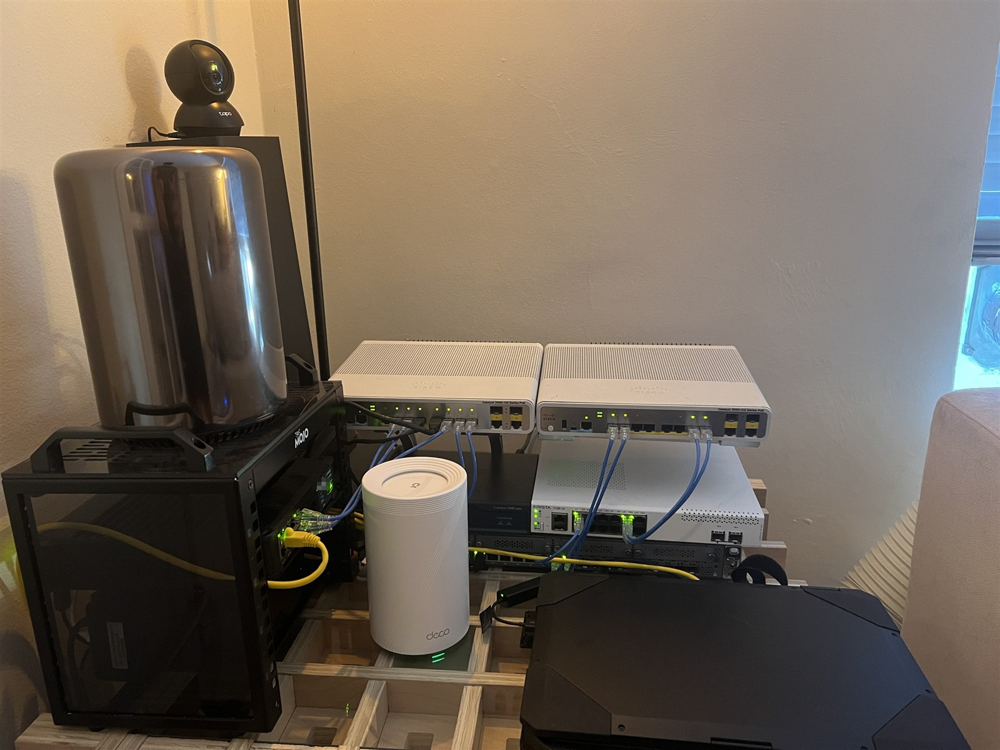
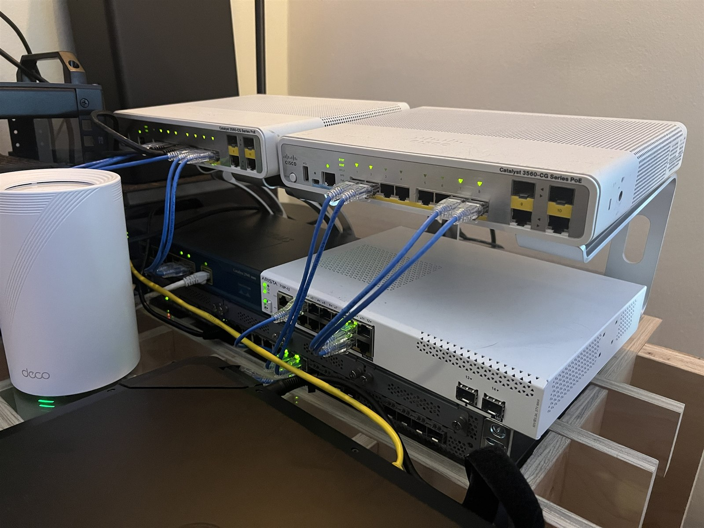

# Casey Allen

### Network & Network Security Engineer — multi-vendor infrastructure and automation

I work in IT systems administration on production infrastructure. This lab is
where I build and break the network engineering side of it: a dual-site
enterprise network on physical hardware, four network operating systems, joined
by a site-to-site IPsec tunnel into a single OSPF routing domain.

Everything below is homelab work, designed, configured, debugged, and documented
by me.

## Projects

| Repo | What it is |
|---|---|
| **[casey-lab](https://github.com/117caseyallen-NetAdm/casey-lab)** | The hub. Topology, fabric reference, and write-ups. Start here. |
| **[homelab-domain-services](https://github.com/117caseyallen-NetAdm/homelab-domain-services)** | AD DS, DNS, and DHCP. A single DHCP server addressing a remote subnet across OSPF and an IPsec tunnel, plus cross-site domain join. |
| **[homelab-wireguard](https://github.com/117caseyallen-NetAdm/homelab-wireguard)** | Routed, non-NATed WireGuard VPN. The client pool is redistributed into OSPF so it is reachable fleet-wide. |

Each repo documents what broke and why, not just the working config.

## The lab

| | |
|---|---|
| **Routing** | Flat OSPF area 0 across a route-based IKEv2 IPsec tunnel (PA-440 ⇄ SRX345). Both firewalls inject default routes as Type-5 LSAs. |
| **Aggregation** | LACP between the SRX, distribution switches, and the Arista. Static EtherChannel to the Catalyst 2940, whose IOS image has no LACP support. |
| **Addressing** | Separate ranges for data, management (`10.99.x.x`), and transit (`10.255.x.x`). |
| **Access** | Dual-homed jumpboxes per site. Management access to network devices restricted to those jumpboxes and the management plane, enforced across four vendors. |

Physical hardware, not GNS3 or EVE-NG:

| | |
|:--:|:--:|
|  |  |

## Working with

**Network** — Palo Alto PAN-OS · Cisco IOS · Juniper Junos · Arista EOS
**Routing & switching** — OSPF · IKEv2 IPsec · 802.1Q · LACP / EtherChannel · VLAN and SVI design · WireGuard
**Platform** — Proxmox VE · LXC · Windows Server · Active Directory · DNS · DHCP · Linux
**Scripting** — PowerShell · Bash · Git

## Certifications

`JNCIA-SEC` · `JNCIA-Junos` · `AZ-700 Azure Network Engineer` · `CompTIA Security+` ·
`CompTIA CySA+` · `CompTIA Network+` · `CompTIA A+` · `ISC2 CC` ·
`AWS Cloud Practitioner` · `Splunk Core Certified User`

In progress: **CCNA**

## Next

Config backup and version control (Oxidized), centralized AAA, 802.1X, and a
NetDevOps pipeline with Batfish validation. Detail in the
[hub roadmap](https://github.com/117caseyallen-NetAdm/casey-lab#roadmap).

## Connect

[LinkedIn](https://www.linkedin.com/in/casey-allen-6612a7133)
